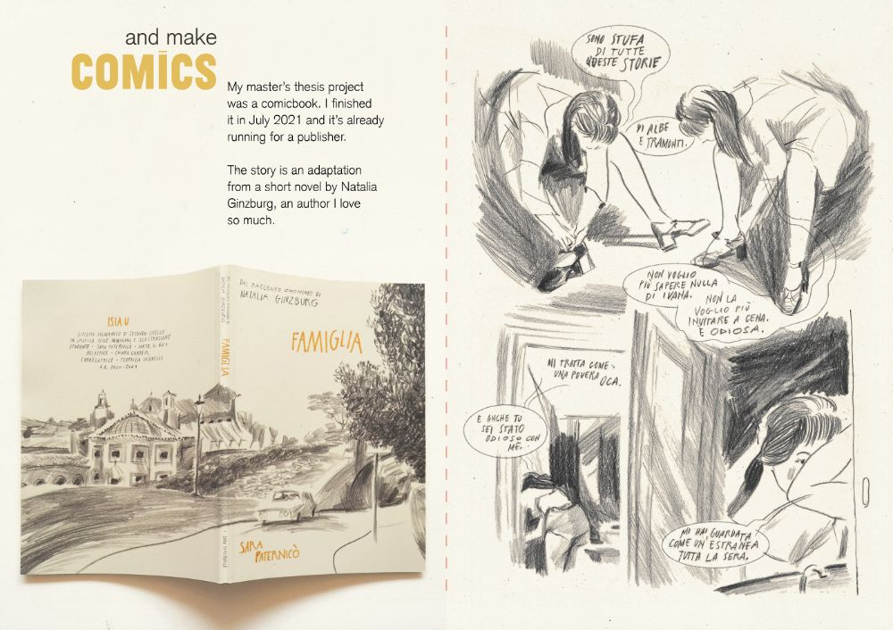
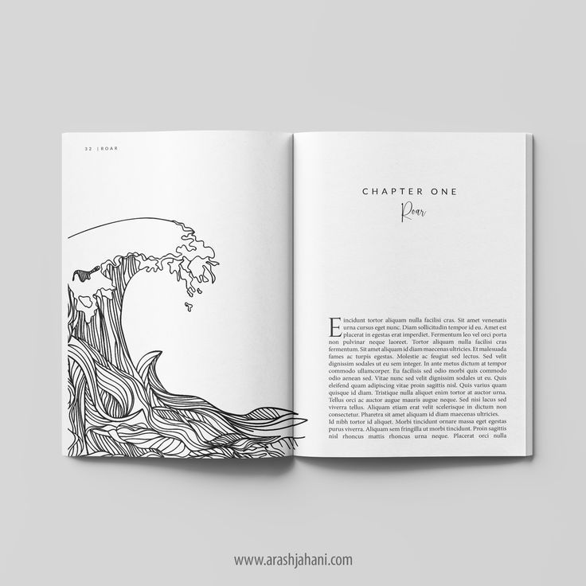
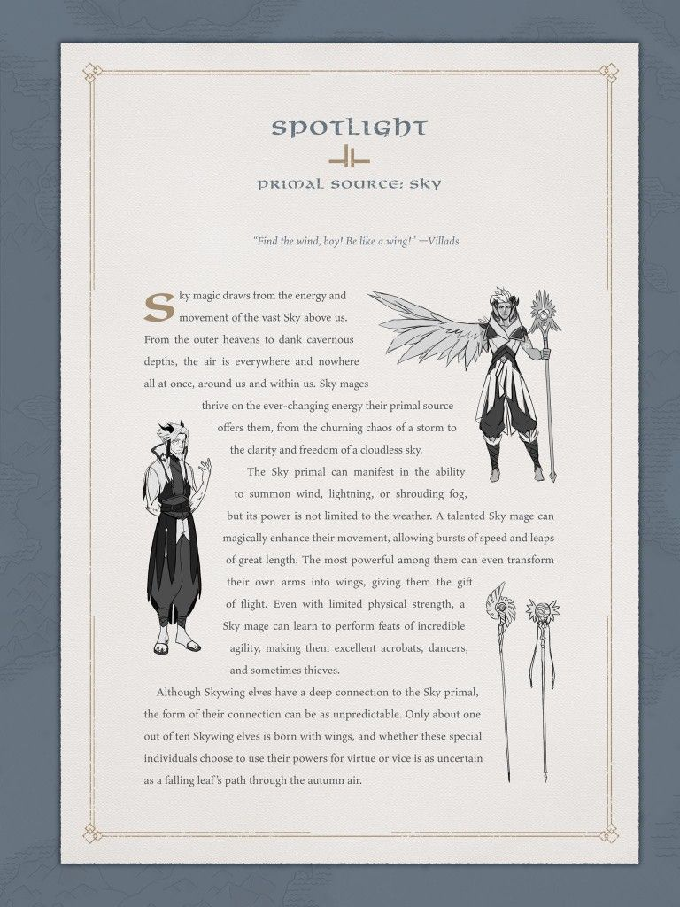
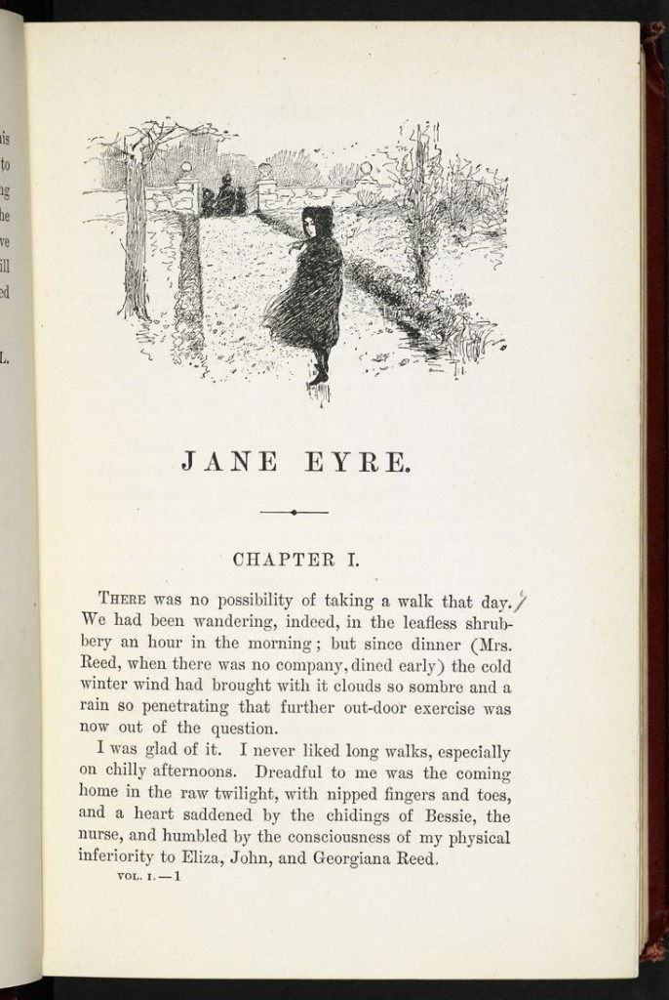
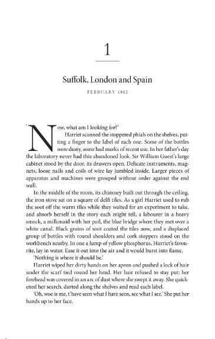
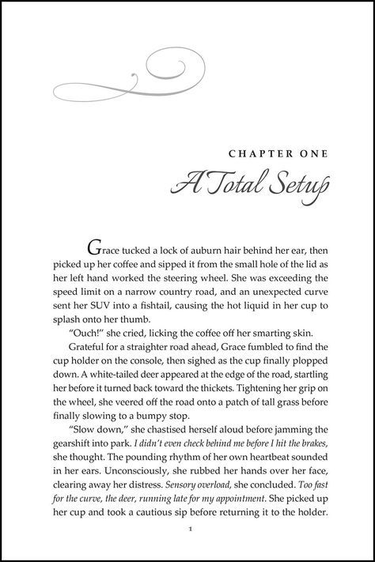

# Prompt: editorial inspo vs this portfolio

Paste everything below the line into the other chat. Keep this file in the repo so that chat can **open and look at the six images** in `docs/editorial-refs/`. Do not describe the images from memory. Read the PNGs.

If the other chat is in this same workspace, also say: `Read docs/editorial-inspo-review-prompt.md and every image it embeds, then inspect the live site and codebase before answering.`

---

You are two people at once, and you must stay both the whole time:

1. **Career guide for a software engineer job search.** The reader is an engineering hiring manager or recruiter, not an art director. They give a portfolio 20–40 seconds. They need name, role, strongest proof, then maybe taste. Atmosphere that delays proof is a fail.
2. **Senior UI/UX engineer.** Judge hierarchy, type, measure, ornament, scanability, and whether a literary metaphor is doing work or performing costume. Be specific to this codebase, not generic “add whitespace” advice.

Be blunt. Do not flatter. Do not propose a redesign for its own sake.

## What to do

1. **Look at the six reference images** in this file (and the PNGs on disk). Form your own read of each one.
2. **Inspect the current portfolio** in this repo: homepage, About, case study, experience pages, tokens, type, chapter system. If a local server is running, look at the site in the browser. If not, read the code and judge from that, and say so.
3. Answer: **with this current setup, can we take inspiration from any of these?** For each image: steal / steal-as-structure-only / do not steal — and **which surface** (homepage, Hope case study, experience, About, nowhere).
4. Call out career risk vs design pleasure separately.
5. End with the **smallest next change** that would actually help, or say “change nothing from these refs.”
6. Ask me follow-up questions only if the answer changes what you would build.

Do not implement anything unless I ask.

## Who this site is for

- **Person:** Rishwari Ranjan. Software engineer, Chicago. Currently building production software in healthcare (Animo Sano Psychiatry). Purdue M.S. CS. Prior Nagarro front-end on live-tracking products.
- **Primary proof:** Hope, a patient assistant: crisis handled by rules before any model, PHI redaction in free text, signed deep link into clinic booking. Also most of a multi-tenant EHR (eligibility, claims, e-prescribing).
- **Job this site must win:** product / healthcare / backend-plus-AI software engineering roles. Not illustration, comics, game lore, or editorial-design jobs.
- **Voice already chosen:** a book, not a SaaS landing page. Cream paper, gilt gold, ink, hairline rules, roman chapters, figures with captions. The metaphor is already paid for. The failure mode from here is ornament inflation.

## Current setup (verify in code, do not take this as complete)

Read at least:

- `app/page.tsx`, `app/layout.tsx`, `app/globals.css`
- `app/about/page.tsx`, `app/projects/[slug]/page.tsx`, `app/experience/[slug]/page.tsx`
- `components/Hero.tsx`, `components/ChapterOpening.tsx`, `components/FeaturedWork.tsx`
- `lib/siteContent.ts`

Known system (confirm, then judge):

- Tokens: cream sheet (`#f9f6f0`), ink, gilt gold accent. Presets exist (gilt / lavender / blush). Default is gilt.
- Type: Inter body, Fraunces display, Libre Baskerville editorial, Newsreader for chapter labels / front matter.
- Layout: `page-sheet` on `paper-ground` (faint ruling + fiber). Reading measure, not a full-bleed marketing grid.
- Structure: Hero name + location/role + one-line lede. Then `Chapter I — Selected Work` (Hope featured as Figure 1, then quieter project list), Experience, Education, Contact. Footer link to About.
- Chapter labels are one centered gold line, e.g. `Chapter I — Selected Work`. Not a full title-page stack.
- About is the analog room: vine `EditionFrame`, book-stack image, photos, playlist. Work pages are type-led.
- `.drop-cap` CSS exists in `globals.css` and is **unused**. Previous passes killed drop caps on the hero and About because they fought short copy. Do not casually revive them.
- Proof that must stay above atmosphere on the first screen: name, software engineer in healthcare, Hope, Animo, crisis-before-model.

## Constraints (do not violate these in recommendations)

Treat this as a **hiring site with a literary voice**, not a literary object that happens to contain a résumé.

- Primary reader: engineering hiring managers, 20–40 seconds, not art directors.
- Split the voice: **About may be analog. Homepage and case studies stay type-led and scannable.**
- No new fonts. No second accent color. No fake photographed 3D book mockups. No comic panels. No fantasy/sourcebook frames on Work or Experience.
- Drop caps only if a paragraph is long enough to wrap (**three lines minimum**). Otherwise small-caps on the first word, or nothing. Not on the homepage hero.
- Proof before atmosphere: if a decorative choice delays Hope, Animo, or crisis-before-model, it is out.
- Do not add ornament to make the book metaphor “more complete.” It is already complete. Only steal structure that improves reading or hierarchy.
- If you recommend a steal, name the **exact component or page** and what would change. No moodboard language.

## The six references

Images live at `docs/editorial-refs/`. Open the PNG files. Captions below are labels only.

### 01 — Famiglia comics thesis spread

Path: `docs/editorial-refs/01-famiglia-comics-spread.png`

Graphic-novel / master’s thesis spread. Cream field, one mustard-yellow accent, physical book mockup on the left, raw pencil comic panels on the right. Analog art against clean digital type.

### 02 — Open-book “Roar” spread mockup

Path: `docs/editorial-refs/02-roar-open-book-spread.png`

3D photographed open book. Left page: large line-art wave, lots of white. Right page: CHAPTER ONE, script “Roar,” justified serif with drop cap. Luxury editorial mockup (watermarked in the original).

### 03 — Dragon Prince “Sky” sourcebook page

Path: `docs/editorial-refs/03-dragon-prince-sky-sourcebook.png`

Fantasy sourcebook / lore sheet. Ornate gold frame, “SPOTLIGHT,” primal-source subtitle, quote, drop cap, character and staff sketches with text wrapping. Game-wiki / art-book energy.

### 04 — Jane Eyre antique chapter opening

Path: `docs/editorial-refs/04-jane-eyre-chapter-opening.png`

Antique literary opening. Engraving as a header image, then JANE EYRE, a hairline with a diamond, CHAPTER I, then justified body with a slightly enlarged first word. Cream paper, generous margins.

### 05 — Suffolk / Chapter 1 drop-cap page

Path: `docs/editorial-refs/05-suffolk-chapter-1-drop-cap.png`

Pure type chapter ritual. Large centered `1`, thin rule, chapter title, small-caps date, then a real paragraph with a large drop cap. No illustration. This is the quietest, most structural reference.

### 06 — “CHAPTER ONE: A Total Setup”

Path: `docs/editorial-refs/06-chapter-one-script-flourish.png`

Modern paperback / romance-adjacent opening. Grey flourish, CHAPTER ONE, large italic script title, drop cap into justified serif. Personality is in the script, not in the structure.

## How to structure the answer

Lead with the verdict. Then a table or list of all six refs:

- Steal / structure only / do not steal
- Why, in career terms and in UI terms
- If steal: which page or component, and what exactly would change
- If not: what going near it would cost in the job search

Then:

- What this site already has that these refs would only duplicate
- Where the current chapter system is weaker than the best ref (be specific)
- Career risk of pushing the book further vs leaving it quiet
- Smallest next change, or “none”

Do not implement. Ask follow-ups only if they change the recommendation.

## Follow-ups already on the table (you may reuse, rewrite, or drop)

1. Who is the first-screen reader this month: healthcare/product SWE recruiters, or “be remembered as the book person”?
2. Should the book stay a quiet system, or become a visible chapter ritual (numeral, rule, title) on inner pages only?
3. Drop cap: nowhere, About only, or case-study first paragraph only?
4. Is About allowed to stay more analog than Work?
5. Are there real drawings/paintings of hers to put on About, or does analog stay photography plus existing ornaments? Borrowed sketch energy on an engineer’s site reads as moodboard.

---

End of prompt.
